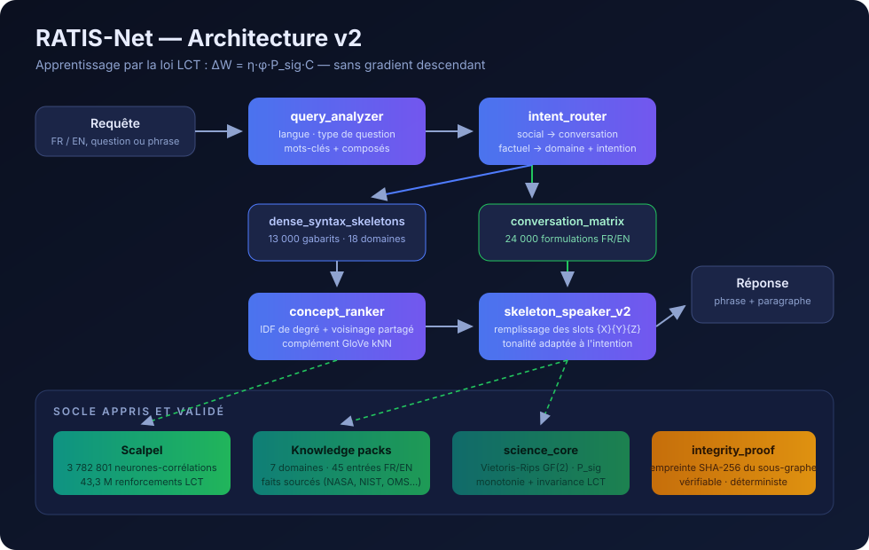
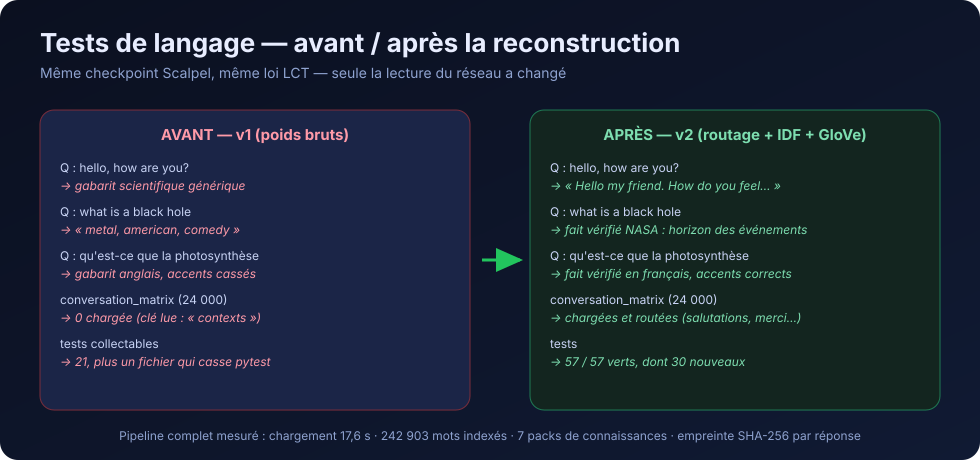
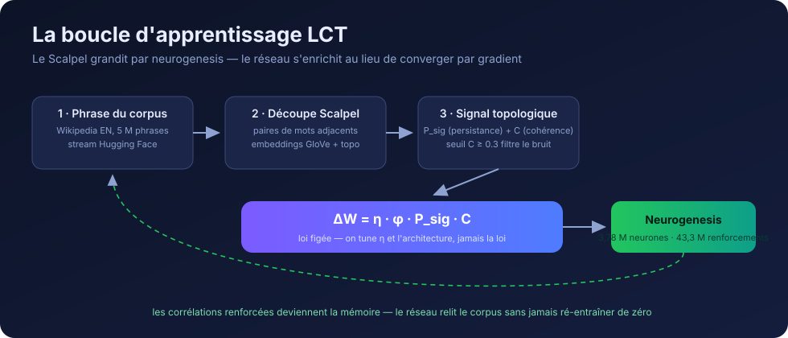

<p align="center">
  
</p>

[](https://github.com/jonathansearch)

# RATIS-Net

**A neural network trained by the Topological Coherence Law (LCT) — without gradient descent.**

[](pyproject.toml)
[](#tests)
[](LICENSE)
[](https://orcid.org/0009-0000-4092-5313)

> Instead of minimizing a loss by backpropagation, RATIS-Net maximizes the
> topological persistence of its correlation graph: it learns by
> becoming topologically robust. The law is frozen:
> **R = P_sig** and **ΔW = η·φ·P_sig·C**.



---

## Installation

```bash
git clone https://github.com/evinajonathan13-max/Ratiss-experimental-IA-.git
cd Ratiss-experimental-IA-
pip install .
git lfs install && git lfs pull          # Scalpel checkpoint (294 MB)
mkdir -p data/glove && curl -L -o data/glove/glove.6B.zip \
    https://nlp.stanford.edu/data/glove.6B.zip
python3 -c "import zipfile; zipfile.ZipFile('data/glove/glove.6B.zip').extract('glove.6B.50d.txt','data/glove/')"
```

Minimal dependency: `numpy`. Extras: `pip install .[full]` (scipy, gudhi),
`.[train]` (datasets), `.[dev]` (pytest).

## 5-minute start

```python
from ratis_net import RatisNet

net = RatisNet()
net.load_scalpel("artifacts/scalpel_wikipedia.pkl")   # 3.78 M neurons
net.load_grammar()                                     # 13,000 + 24,000 templates
net.load_knowledge_packs()                             # 7 domains, sourced facts
net.build_index()                                      # ~9 s, 242,903 words

net.respond("hello, how are you?")
# → "Hello my friend. How do you feel about this today, ..."

r = net.respond_with_science("what is a black hole")
r["sentence"]
# → "A black hole is a region of spacetime whose gravity is so strong that
#    nothing, not even light, can escape once past the event horizon. ..."

net.respond("qu'est-ce que la photosynthèse")
# → verified fact in French (bilingual knowledge base)
```

## Command line

```bash
ratisnet converse "hello, how are you?"
ratisnet ask "what is a black hole"
ratisnet ask "qu'est-ce qu'un trou noir" --json
ratisnet concepts --word quantum --n 10
ratisnet chain --from quantum --to gravity
ratisnet prove --concepts quantum,mechanics
ratisnet stats
```

## HTTP server (API)

```bash
ratisnet-serve --port 8000
```

| Endpoint | Body | Response |
|---|---|---|
| `GET /health` | — | status + network statistics |
| `POST /respond` | `{"q": "..."}` | sentence + concepts + skeleton |
| `POST /science` | `{"q": "..."}` | enriched answer: verified facts + LCT |
| `POST /concepts` | `{"word": "quantum"}` | concepts ranked by relevance |
| `POST /chain` | `{"from": "a", "to": "b"}` | traced association chains |
| `POST /prove` | `{"concepts": [...]}` | SHA-256 fingerprint of the subgraph |

---

## What the v2 pipeline does



1. **query_analyzer** — detects the language (FR/EN), classifies the question type
   (greeting, definition, explanation, identity…), extracts keywords and
   compounds ("black hole").
2. **intent_router** — social → conversational matrix (24,000 wordings);
   factual → dense grammar (18 domains, 12 intents).
3. **concept_ranker** — ranks concepts by degree IDF, shared
   neighborhood between keywords, and GloVe kNN complement. No more
   ubiquitous co-occurrences at the top of the list.
4. **skeleton_speaker_v2** — fills the grammatical templates with the
   ranked concepts, tone adapted to the intent.
5. **knowledge packs** — sourced verified FR/EN facts (NASA, NIST, IUPAC,
   WHO, NIH) injected at the head of the answer when the concept is covered.
6. **integrity_proof** — each answer can carry the SHA-256 fingerprint
   of the correlation subgraph that produced it (verifiable, deterministic).



---

## Full Python API

| Method | Description |
|---|---|
| `respond(q)` | Answer sentence (auto-detected language) |
| `respond_with_science(q)` | Sentence + verified facts + LCT measurement + web if unknown |
| `paragraph(theme, n_sentences=5)` | Paragraph on a theme |
| `concepts(word, n=10)` | Concepts ranked by relevance |
| `chain(a, b, max_hops=3)` | Association chains (correlation, not causality) |
| `prove(concepts)` | SHA-256 fingerprint of the subgraph |
| `verify_proof(proof)` | Checks that a fingerprint reproduces |
| `lookup_knowledge(concept)` | Validated facts from the 7 packs |
| `search(query)` | Web search (DuckDuckGo, keyless) |
| `stats()` | Network statistics |

## Tests

```bash
python -m pytest tests/ -q     # 57/57
```

- `test_scalpel.py` — neurogenesis and LCT reinforcement (8)
- `test_ratiss_synchrotron.py` — topological reconstruction (9)
- `test_lct_modules.py` — topological qubit, LCT transformer (4)
- `test_lct_new_systems.py` — LCT law on social networks and crystals (4)
- `test_language_pipeline.py` — analyzer, router, ranker, chains, proofs (19)
- `test_language_quality.py` — **end-to-end language test on the real
  checkpoint**: conversation, science, biology, FR/EN (13)

## Honest limits

1. RATIS-Net is not a knowledge base: it reconstructs from
   learned fragments; exact facts come from the knowledge packs.
2. Template grammar: correct, not as fluent as a Transformer.
3. The Scalpel captures adjacent pairs after cos(GloVe) ≥ 0.3 filtering;
   non-adjacent compounds ("black hole") are reconstructed at analysis time.
4. Coverage = Wikipedia EN corpus + packs; the web compensates for the unknown.
5. Association chains are traced correlations, not inferences.
6. The Scalpel checkpoint is English; French goes through the templates
   and the packs (full multilingual = open track).
7. The SHA-256 integrity proof is not a ZK-STARK: it commits to the
   data, it does not prove a private computation.
8. Corpus bias persists in the raw concepts (Wikipedia: "black"
   neighbors "metal") — the ranker mitigates it, does not erase it.

## Intellectual property

© 2025-2026 **Jonathan Evina & JOHNKING0** — all rights reserved.
Proprietary license: see [LICENSE](LICENSE). No MIT or Apache
license applies. ORCID [0009-0000-4092-5313](https://orcid.org/0009-0000-4092-5313) ·
DOI [10.17605/OSF.IO/6JZMB](https://doi.org/10.17605/OSF.IO/6JZMB).
